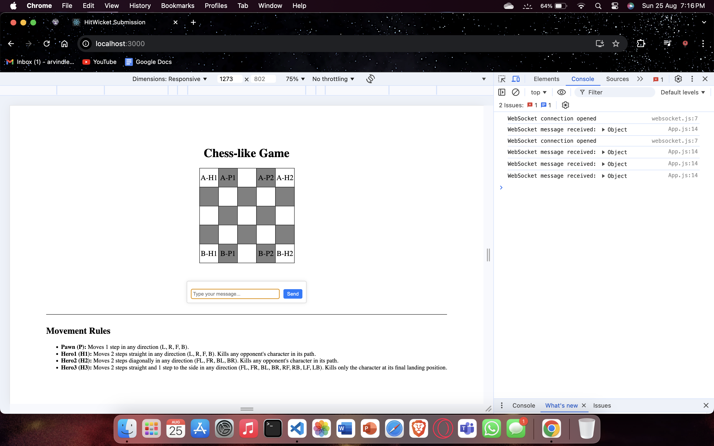
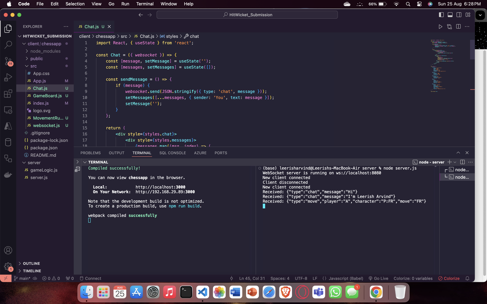

# Chess-like Turn-Based Strategy Game

## Introduction

This project involves creating a turn-based strategy game, similar to chess, where two players engage on a 5x5 grid. Each player manages a team consisting of three unique characters: Pawn, Hero1, and Hero2, each with specific movement and abilities.

The game is structured with a server-client architecture, using WebSockets to enable real-time communication between players. The user interface is built with React, ensuring an interactive and dynamic web-based gaming experience.

## Features

- **Turn-based Gameplay:** Players take turns to move their characters.
- **Three Character Types:** Each character type has unique movement and attack patterns.
- **WebSocket Integration:** Real-time communication between the server and the client.

## Overview

### Demo

### Console Output

### Terminal Logs

## Technology used

### Front-End

ReactJS

### Back-End

NodeJs

## Installation

### Install Server Dependencies

> `cd server`

> `npm install`

### Install Client Dependencies

> `cd ../client`
> `npm install`

## Start Server

`cd ../server`

`node server.js`

## Start Client

> `cd ../client`
> `npm start`
